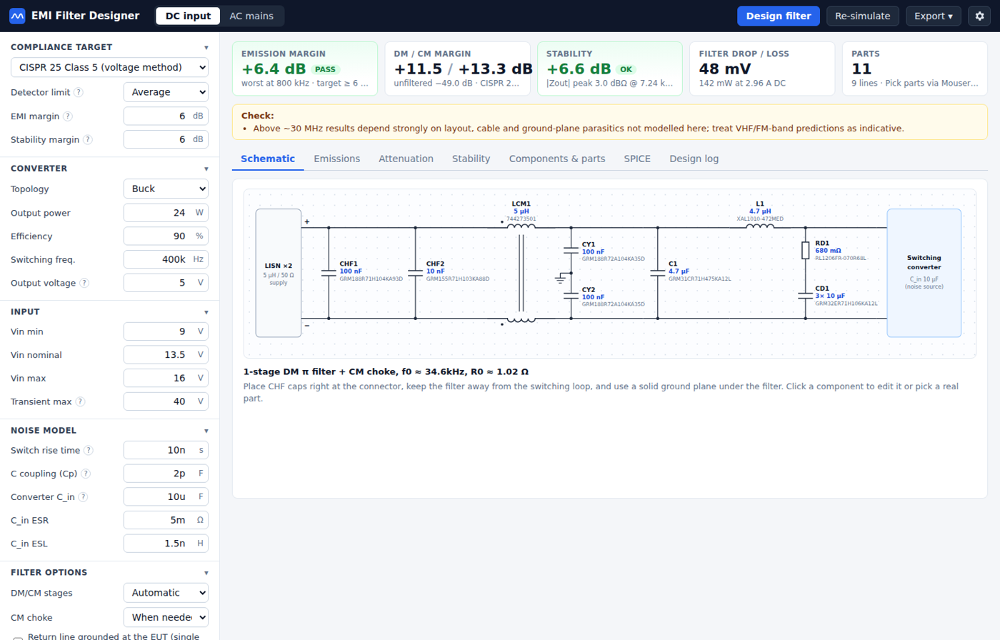
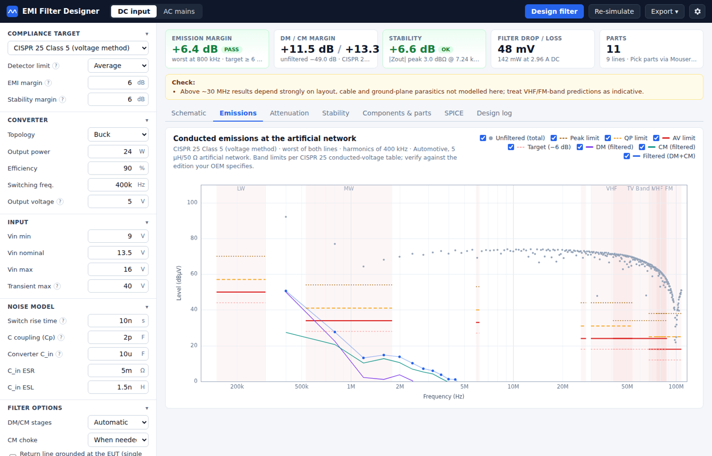
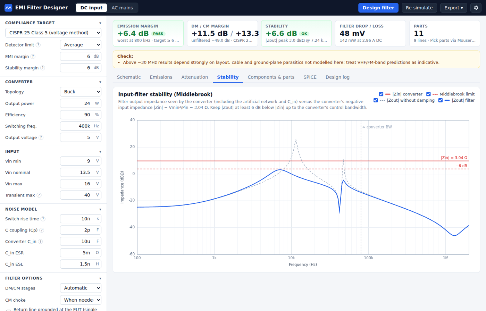
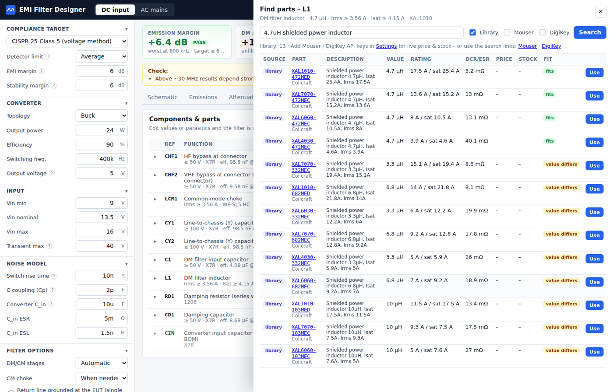

# EMI Filter Designer

**Design, simulate and source input EMI filters for switching power supplies, with real parts from Mouser and DigiKey.**

EMI Filter Designer takes a description of your converter (topology, power, switching frequency, input range) and a compliance target such as CISPR 25 or CISPR 32. From these it:

1. designs a front-end EMI filter from real, orderable parts,
2. simulates it against the conducted-emission limits,
3. checks the filter doesn't make the converter unstable, and
4. exports a BOM, a SPICE netlist and a printable design report.

It comes in two versions built from the same code:

* **Desktop app (Windows):** a single `.exe`, nothing to install.
* **Web app:** runs entirely in your browser (the Go engine compiled to WebAssembly). It can be hosted free on GitHub Pages.



| Emissions vs. limits | Stability (Middlebrook) | Part search |
|---|---|---|
|  |  |  |

> **Status:** early release (v1.0). The simulation engine is tested (see [Testing](#testing)), but this is a design aid, not a substitute for measurement. Always verify with a pre-compliance scan.

---

## Features

**Filter types**
- **DC input** filters for DC/DC converters (buck, boost, buck-boost, flyback/forward):
  - π filter with optimum R–C damping (Erickson method)
  - optional common-mode choke and line-to-chassis capacitors
  - single- or two-stage filters
- **AC mains** filters for flyback and boost-PFC supplies:
  - common-mode choke(s) with X2/Y1 capacitors, and DM inductors when needed
  - Y capacitance limited by your leakage-current budget
  - X-capacitor bleeder resistors

**Standards**
- CISPR 25 Class 1–5 (conducted, voltage method, 5 µH artificial network)
- CISPR 32 / EN 55032 Class A & B, CISPR 11 / EN 55011 Group 1 Class A & B, FCC Part 15 Class A & B (50 µH LISN)

**Simulation**
- Every switching harmonic is solved with a full nodal analysis of the test setup: artificial network(s), the filter and the converter's input capacitance.
- Component models include capacitor ESR/ESL, inductor DCR and self-resonance, CM-choke leakage (coupled windings) and MLCC DC-bias derating.
- DM and CM noise are shown separately, plus their worst-case sum, against PK/QP/AV limits and your margin target.
- In-circuit attenuation, plus 50 Ω / 50 Ω (CISPR 17-style) DM and CM insertion loss.
- Middlebrook stability check: filter |Zout| against the converter's negative input impedance, with and without damping.

**Parts**
- A built-in library of real part numbers, checked against manufacturer catalogs:
  - Murata MLCCs
  - Coilcraft XAL inductors
  - Würth WE-CMB / WE-SL5 HC common-mode chokes
  - TDK X2 and Murata Y1 capacitors
  - Panasonic electrolytic and hybrid-polymer capacitors
  - Yageo resistors
- Live **Mouser** and **DigiKey** search with price and stock, using your own free API keys.
- Clicking **Use** on a search result copies the part's value and parasitics into the design and re-simulates.

**Exports**
- Design report (HTML, print to PDF)
- BOM (CSV with distributor links)
- SPICE netlist for LTspice or ngspice, including the LISNs, parasitics and noise sources
- Project files you can reopen

---

## Getting started

### Option 1: Windows desktop app
1. Download `EMI-Filter-Designer-Windows.zip` from the [Releases](../../releases) page.
2. Unzip it and double-click **`EMIFilterDesigner.exe`**. The app opens in its own window using Microsoft Edge, which comes with Windows 10/11.
3. The exe isn't code-signed, so SmartScreen may say *"Windows protected your PC"*. Click **More info → Run anyway**.

Closing the window stops the app. Settings live in `%APPDATA%\EMI Filter Designer\`.

### Option 2: Web app
Open the project's GitHub Pages site. You can also download `index.html` from Releases and open it locally. Everything runs in your browser and no data is sent anywhere, except distributor searches if you enable them.

### Option 3: Run from source (any OS)
```sh
git clone https://github.com/<you>/emi-filter-designer.git
cd emi-filter-designer
go run .          # starts the app and opens it in Edge/Chrome or your default browser
```
Requires [Go](https://go.dev/dl/) 1.22 or later. There are no third-party dependencies.

---

## Using it

1. Pick **DC input** or **AC mains**, then fill in the left panel: the standard, the converter, the input range and the noise model.
2. Click **Design filter** (or press Ctrl+Enter).
3. Review the results tabs: **Schematic**, **Emissions**, **Attenuation** and **Stability**. Hover over the charts to read values and margins.
4. In **Components & parts** you can:
   - edit values, quantities and parasitics; the filter re-simulates as you type,
   - click **Find parts** to swap in a real component.
5. Use **Export** to save the report, BOM, SPICE netlist or project file.

### Mouser / DigiKey API keys (optional)
Open **⚙ Settings**:
- **Mouser:** log in at mouser.com, go to *API Hub → Search API*, and request a free key.
- **DigiKey:** at developer.digikey.com, create an organization, then a *Production* app with **Product Information V4**. Use its Client ID and Client Secret.

The desktop app stores keys in `%APPDATA%`; the web app stores them in your browser's local storage. Browsers only allow the web app to call these APIs if the distributor permits requests from web pages (CORS). If searches fail in the web app, use the desktop app, or set a proxy that you run yourself.

### Getting the noise model right
The most uncertain input is **Cp**, the effective capacitance from the switching node to chassis/PE:
- **Small DC/DC board above a ground plane:** a few pF.
- **Off-line supply with a heatsink or transformer to PE:** tens of pF.

If you have a pre-compliance scan, adjust Cp (and the rise time) until the unfiltered prediction matches it. After that, the filter predictions become much more reliable.

---

## How it works

Each switching harmonic *n·f<sub>sw</sub>* gets two noise sources:
- **DM:** the converter's input current, a trapezoid for pulsed-input topologies or a triangle for boost/PFC. It is injected across the converter's input capacitor.
- **CM:** the switch-node voltage, coupled to chassis through Cp.

Both are evaluated at the minimum, nominal and maximum input voltage, and the worst case is used. The whole circuit is solved at each harmonic with modified nodal analysis (MNA) using complex admittances. That circuit includes the LISN(s), every filter part with its parasitics, the converter's input cap and the noise sources. The receiver voltage then gives dBµV.

The designer searches the filter's corner frequency, choke selection, X/Y capacitors and damping network. It aims for the smallest filter that meets the EMI margin *and* the Middlebrook stability margin.

See **[docs/ARCHITECTURE.md](docs/ARCHITECTURE.md)** for the full design of the code and the models.

### Limitations
- Layout coupling (loop areas, near-field), cable resonances and radiated paths are **not** modelled. Treat predictions above about 30 MHz as indicative.
- Library parameters come from manufacturer catalogs. Check them against current datasheets before releasing a design.
- The CISPR 25 limit table follows the widely published conducted-voltage limits. Check it against the edition and OEM specification you are designing to.

---

## Project layout

```
main.go              desktop app: local HTTP server + app window (Edge/Chrome --app)
engine/              simulation & design engine (pure Go, no dependencies)
  mna.go               complex MNA solver (R, L, C, coupled L, sources)
  netbuild.go          component parasitic models, LISNs, converter model
  noise.go             noise-source spectra and operating points
  limits.go            CISPR / FCC limit tables
  analysis.go          emissions, attenuation, insertion loss, stability
  design.go            automatic DC and AC filter synthesis
  library.go           built-in part library + value helpers
  export.go            SPICE netlist and BOM CSV
parts/               Mouser & DigiKey API clients, result parsing and ranking
cmd/wasm/            WebAssembly entry point for the web version
web/                 UI (plain HTML/CSS/JS, no frameworks or build step)
tools/build_pages.py bundles the web UI + WebAssembly into one index.html
winres/              Windows icon, manifest and version info (compiled into rsrc_windows_amd64.syso)
docs/                architecture notes and screenshots
```

## Building

| Target | Command | Output |
|---|---|---|
| Run locally | `go run .` | opens the app |
| Windows exe | `./build.sh` or `build-windows.bat` | `dist/EMIFilterDesigner.exe` |
| Web version | `./build-pages.sh` | `pages/index.html` (single file) |
| Everything | `make all` | all of the above |

If you use the included GitHub Actions:
- the web version is built and deployed to GitHub Pages on every push to `main`;
- pushing a tag like `v1.0.1` builds the Windows exe and `index.html` and attaches them to a GitHub Release.

## Testing

```sh
go test ./...
```

The test suite covers:
- the MNA solver against analytic RC, LC and coupled-inductor results,
- the limit tables and noise-harmonic formulas,
- the Mouser/DigiKey response parsers,
- eight end-to-end design scenarios, DC and AC.

The exported SPICE netlist has been cross-checked against an independent solver: the LISN transfer functions agree to within 0.0001 dB.

## Publishing your own copy on GitHub

1. Create an empty **public** repository on GitHub, e.g. `emi-filter-designer`.
2. Upload this project to it. Either:
   - **GitHub Desktop:** *File → Add local repository*, choose this folder, then **Publish**; or
   - **Command line:**
     ```sh
     git init && git add . && git commit -m "Initial commit"
     git branch -M main
     git remote add origin https://github.com/<you>/emi-filter-designer.git
     git push -u origin main
     ```
   Uploading through the website (*Add file → Upload files*) also works, but it can skip the hidden `.github` folder that holds the automation. Use one of the options above if you want the automatic website and releases.
3. **Turn on the website:** go to *Settings → Pages → Source* and choose **GitHub Actions**. Every push to `main` now rebuilds and publishes the web app at `https://<you>.github.io/emi-filter-designer/`.
4. **Publish a downloadable release:** push a tag (`git tag v1.0.0 && git push origin v1.0.0`). The Windows zip and `index.html` appear under *Releases*.

## Contributing

Contributions are welcome: new parts for the library, new standards, better noise models, UI improvements, bug reports. Please read **[CONTRIBUTING.md](CONTRIBUTING.md)** first. Everyone taking part is expected to follow the [Code of Conduct](CODE_OF_CONDUCT.md).

## License

[MIT](LICENSE). You're free to use, modify and distribute this, including commercially.

## Disclaimer

This software predicts conducted emissions from simplified models. It does not guarantee compliance with any standard. Part data may be out of date or wrong. You are responsible for verifying designs, especially safety-relevant parts: X/Y capacitors, creepage and clearance, and leakage current. See the license for the full warranty disclaimer.
